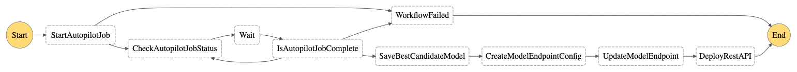
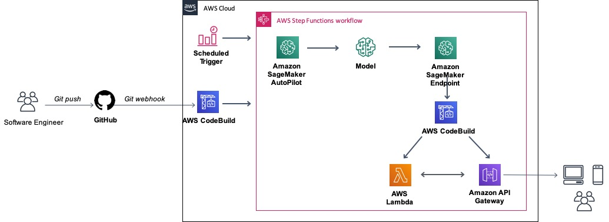
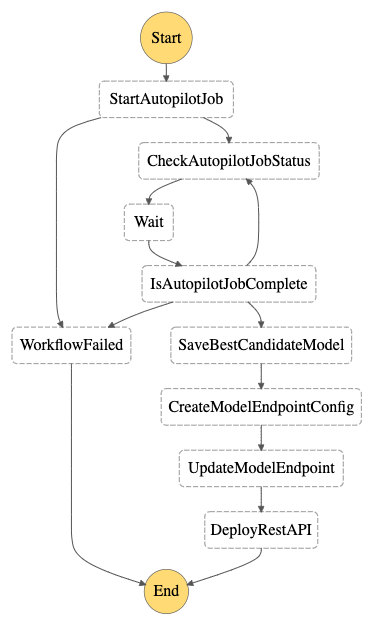

# Automate the end-to-end AutoML lifecycle with Amazon SageMaker Autopilot on Amazon Step Functions

<h2>(CD4AutoML)</h2>

This repository is a getting started/ready to use kit for deploying and running repeatable machine learning pipelines 
with Amazon SageMaker Autopilot. The project leverages with Amazon CodeBuild service integration with Amazon Step Functions
to deploy an Amazon API Gateway for serving predictions. With this project, you can easily jump start your continuous 
integration and continuous deployment automated machine learning workflow with Amazon SageMaker Autopilot.

## Architecture

This project is designed to get up and running with CD4AutoML (I coined this), much [CD4ML](https://martinfowler.com/articles/cd4ml.html) 
from [Martin Fowler's blogpost](https://martinfowler.com/articles/cd4ml.html).

### Technologies:
- Amazon Cloudformation
- Amazon Step Functions
- Amazon CodeBuild
- AWS Step Functions Data Science SDK
- AWS Serverless Application Model
- Amazon Lambda
- Amazon API Gateway
- Amazon SSM Parameter Store

This project gets you out of the play/lab mode with Amazon SageMaker Autopilot into running real-life applications with Amazon SageMaker Autopilot.

### State machine Workflow
The entire workflow is managed with AWS Step Functions Data Science SDK.
Amazon Step Functions does not have service integration with Amazon SageMaker Autopilot out of the box. To manage this, I leveraged 
Amazon Lambda integration with Step Functions to periodically poll for Amazon SageMaker Autopilot job status.

Once the AutoML job is completed, a model is created using the Amazon SageMaker Autopilot Inference Containers, and an Amazon 
SageMaker Endpoint is deployed. But there is more...

On completion of the deployment of the Amazon SageMaker Endpoint, an Amazon CodeBuild Project state machine task is triggered 
which deploys our Amazon API Gateway with AWS Serverless Application Model.

See workflow image below:

<strong>CD4AutoML</strong>

## Future Work
I have plans to abstract away all deployment details and convert this into a Python Module or better put AutoML-as-a-Service.
Users can either provide their Pandas DataFrame or local CSV/JSON data, and the service takes care of the rest. Users will
get a secure REST API which they can make predictions in their applications.

If you're interested in working on this together, feel free to reach out. Also feel free to extend this project as it suites 
you. Experiencing any challenges getting started, create an issue and I will have a look as soon as I can.  